### 1. Cache Introduction
- “In computing, a cache is a hardware or software component that stores data so that future requests for that data can be served faster; the data stored in a cache might be the result of an earlier computation or a copy of data stored elsewhere” - Wikipedia
- Cache is a shield for DB
- Trade-off
  + Space vs Cost
  + Space vs Performance

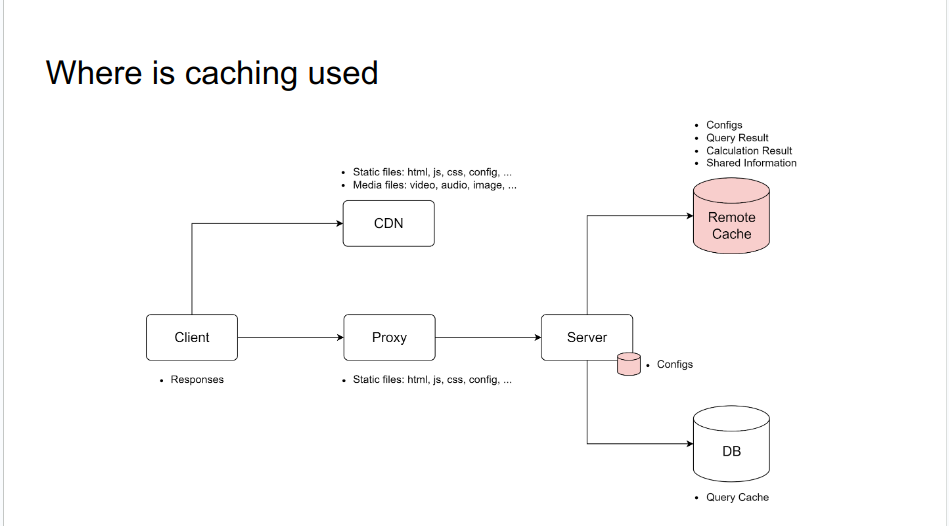.

### 2. Read Strategies
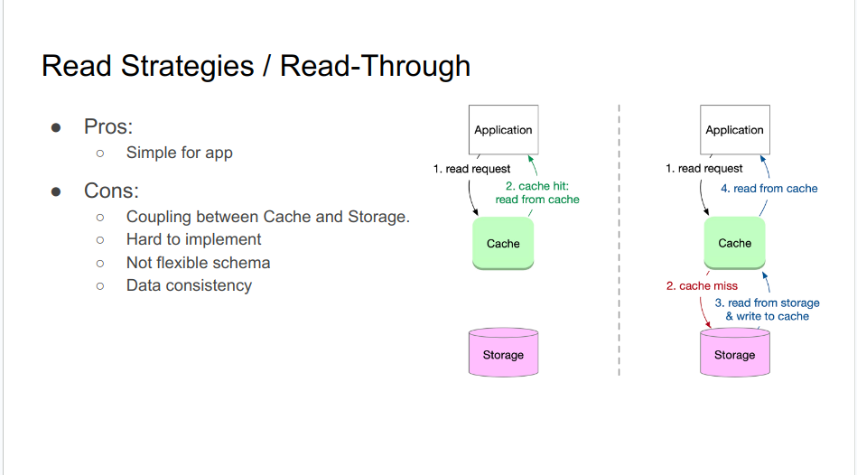.

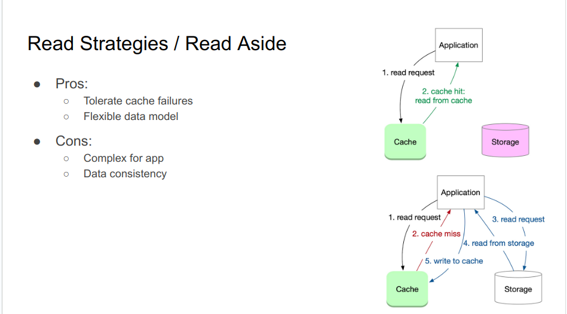.

### 3. Write Strategies
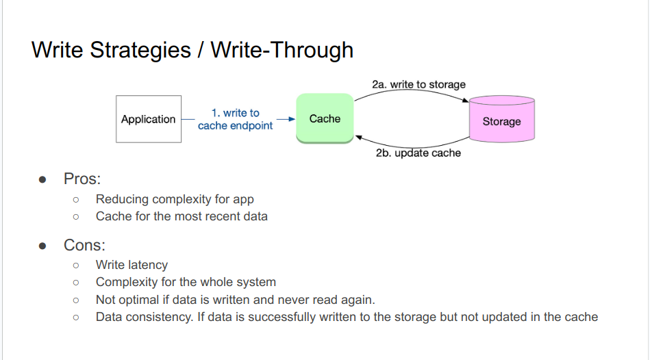.

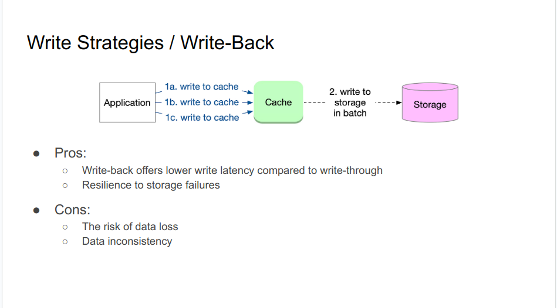.

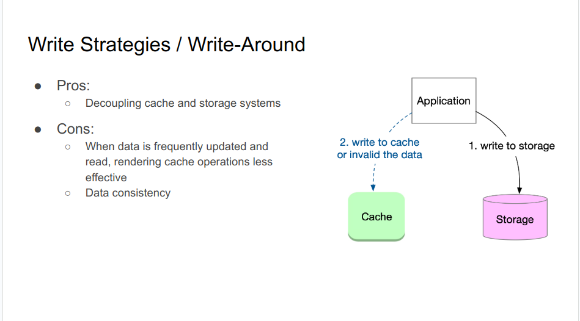.

### 4. What is common problem
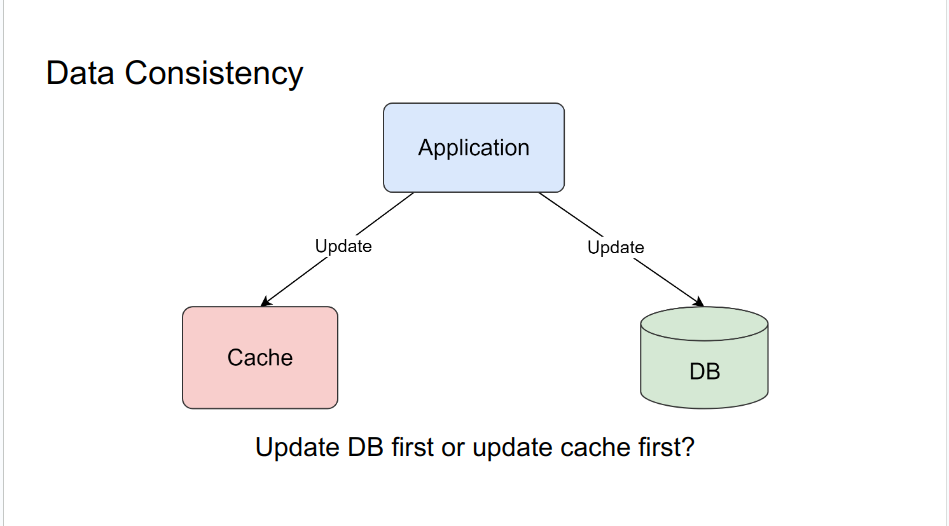.
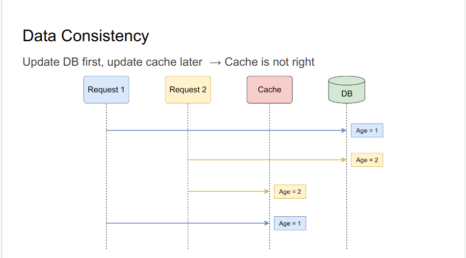.
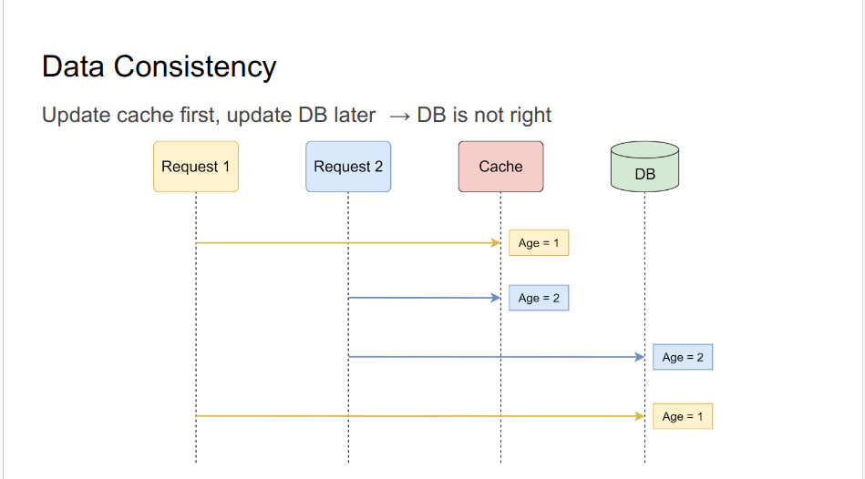 
.

#### Data Consistency
  + Updating cache and updating database at the same time does not work
  + Deleting cache and updating database?

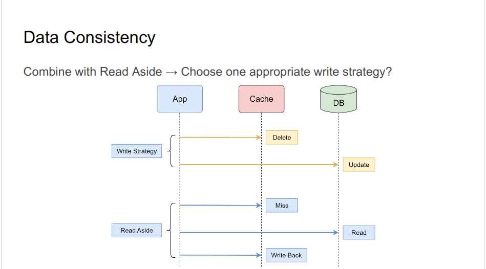.
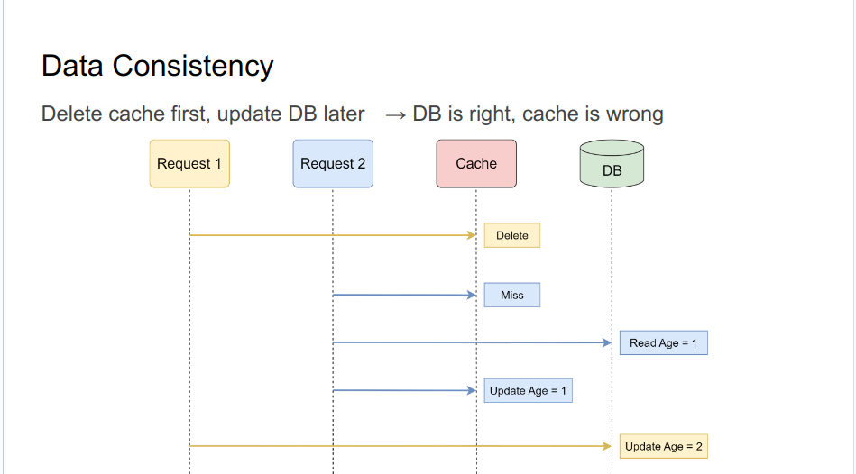.
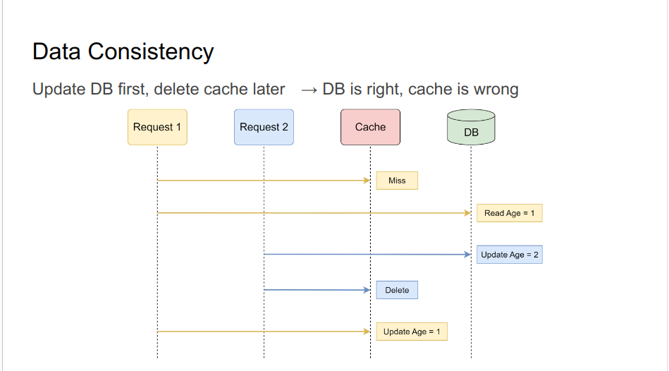.

#### Data Consistency
  + Data inconsistency still !
    - Which one should we choose? 
    - And Why?
    - How can we mitigate the impact?
  + Answers:
    - Update DB first, delete cache later
    - In practice, the probability of updating cache after updating DB is not high. Because cache writes usually much faster than DB writes.
    - Add short TTL to cache data

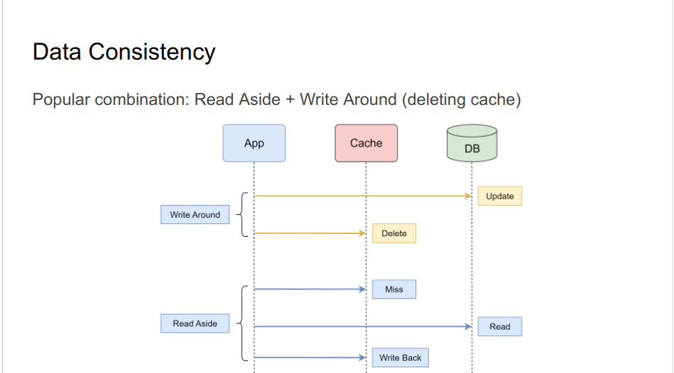.

### 5. Reliability Challenges
#### Problem 01: No Atomicity
- Problem Context: Customer update age from 1 → 2. But customer complains that it needs some time to take effect.
- Cause: Updating DB is done, but deletion of cache failed → old value in cache, taking some time to take effect
- Solution:
  + **Retry**
  + Subscribe to MySQL binlog

#### Problem 02 - Cache Avalanche
- Problem: Cache goes down for some reason, there are a large number of requests at this time 
→ DB down

- Solution:
  + Cache Cluster → High Availability
  + Rate Limit / Circuit breaker
  + Cache Recovery.

#### Problem 03 - Cache Breakdown
- Problem: If a large amount of cached data expires at the same time 
or a hotspot data in the cache expires → DB down

- Solution:
  + Set the expiration time evenly
  + Mutex
  + Do not set an expiration time for the hotspot data
  + Background task to update cache periodically or before the cache expires

#### Problem 04 - Cache Penetration
- Problem: There is data neither in cache nor in DB. When a large number of requests hit that data (maybe made by attacker) → cache miss → DB miss → DB down

- Solutions:
  + Set default value. Example: null value
  + Validate requests
  + Use the Bloom filter to quickly determine whether the data exists

### 6. High Traffic Challenges
#### Problem 05: Hot Keys 
- Problem: Some keys experiencing exceptionally high traffic

- Solutions:
  + Replicate the key into multiple keys and distribute them across multiple nodes
  + Local cache to hot keys

#### Problem 06: Large Keys
- Problem: The size of a key is significantly large

- Solutions:
  + Compress
  + Set a longer TTL for large keys
  + Limit the number of large keys

### 7. Cache Replacement
- Least Recently Used (LRU)
  + Use case: hot keys

- Least Frequently Used (LFU)
  + Use case: Hot tweets

- LRU + LFU

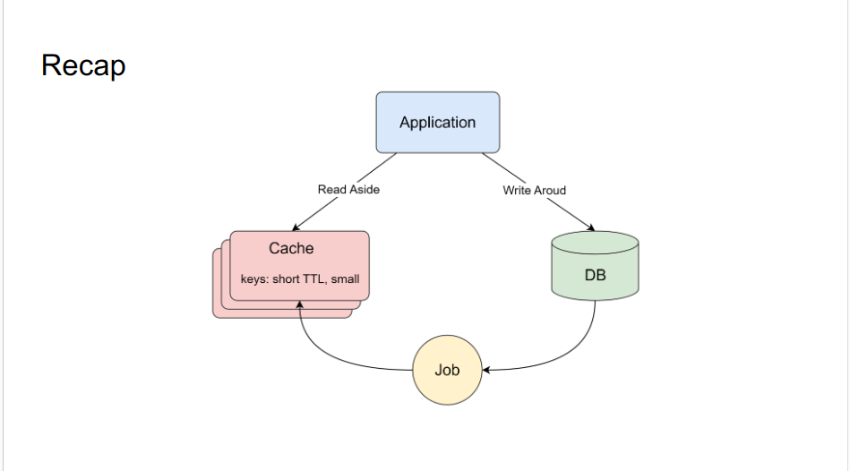.