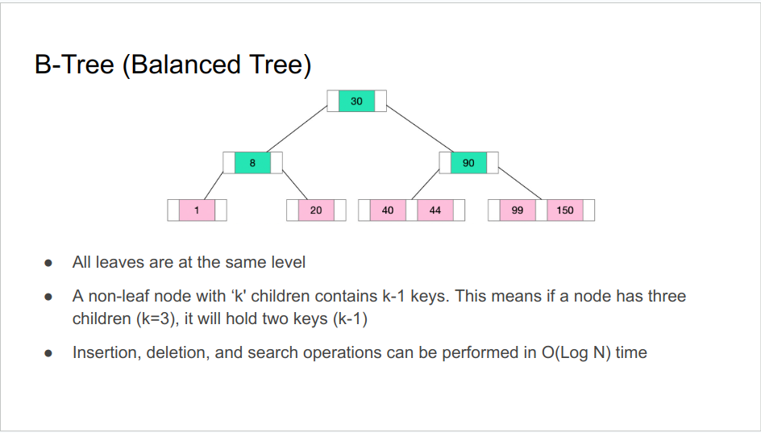
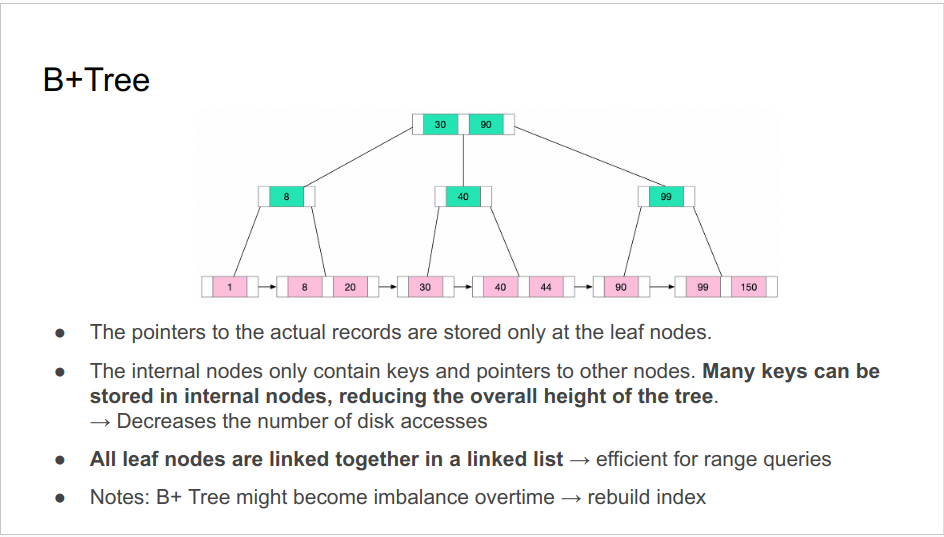
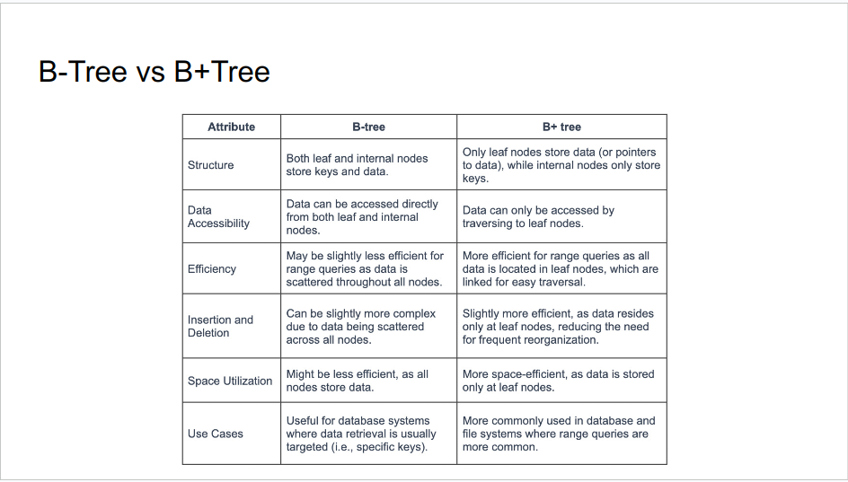
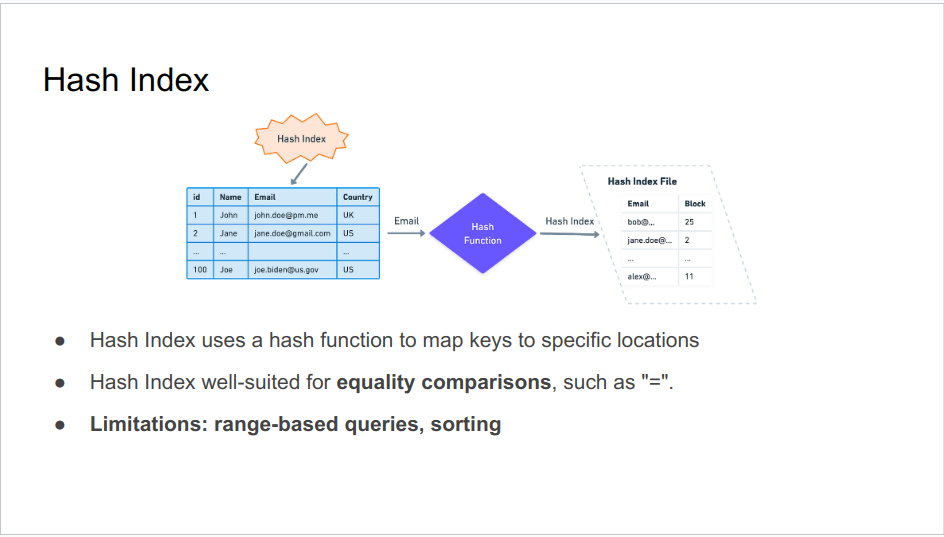
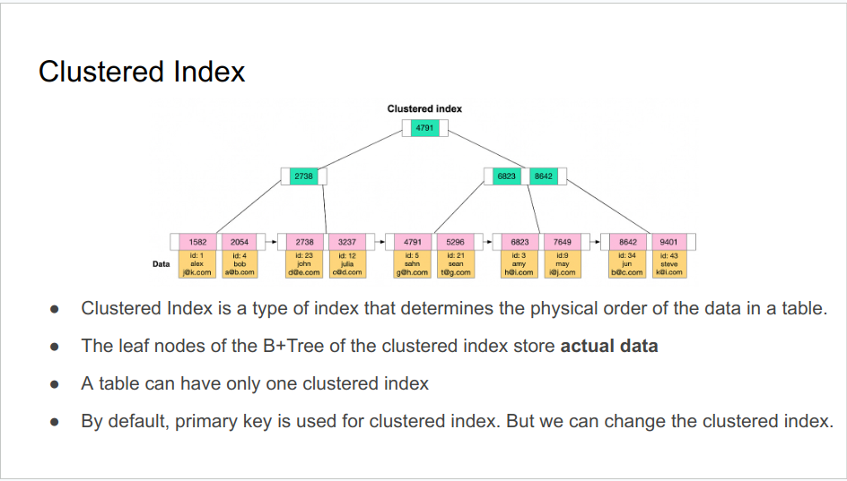
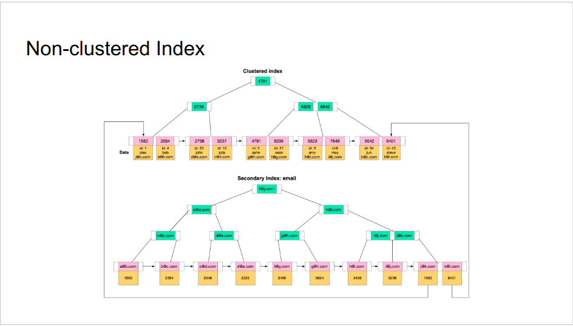

### 1. Index Introduction
- An index is a data structure that improves the speed of data retrieval operations.
- Indexes are typically stored on disk.
- Classification:
  + By data structure: B+ tree index, Hash index, Full-text index
  + By physical storage: Clustered Index, Secondary Index
  + By number of fields: Single-column Index, Composite index
  + By characteristics: Primary key Index, Unique Index, Prefix Index

### 2. Data Structure
.
.
.
.

### 3. Physical Storage Index
.
.

- Non-clustered Index
  + Indexes are not clustered index, then non-clustered (secondary) indexes.
  + The value (the leaf node of B+ Tree) of secondary index is the primary key value
  + A table can have multiple secondary indexes
  + Accessing data using a secondary index involves at least two disk reads. One to access the secondary index and another to access the clustered index to get actual data.
  + What are disadvantages of indexes?
    - Slowing down write operations
    - Occupying physical space
    - It takes time to create and maintain indexes
  + Why the value of secondary index point to the primary key value, 
not the disk address?
    - the disk address of records might be change during table operating, defragment, …

### 4. Characteristics
- What is the difference between key & index?
  + Key means a constraint imposed on the behaviour of the column. 
Example: primary key is non nullable field which uniquely identifies each row.
  + Index is a special data structure that facilitates data search across the table.

- <b>Primary Index</b>
  + Primary Index is a specific type of index that serves as a unique identifier for each row in a table.
  + If the key is sequential, writing to the table is generally efficient.

- <b>Unique Index</b>
  + The value of the index column must be unique, but null values ​​are allowed.
  + Command: CREATE UNIQUE INDEX index_name ON table_name(index_column_1,index_column_2,...); 

### 5. Number of Columns
- <b>Composite Index</b>
  + Composite Index is a multi-column index.
  + The more columns in a composite index, The more storage space in used

- <b>Covering Index</b>
  + A covering index is an index that contains all the columns in the SELECT
  + Answering the query by using the index alone, reducing disk I/O operations 
→ improve the performance significantly
  + Recommended: =< 5 columns

- <b>Other Indexes</b>
  + Classified by data structure:
    - Full-text Index 
    - Spatial Index
    - Bitmap Index

### 6. Best Practices
- Limit the Number of Indexes
- The primary key index is preferably self-incrementing
  + No need to move the existing data
  + Reduce page split, fragmentation
- The index is best set to NOT NULL
  + Value comparison more complicated
  + NULL value is a meaningless value, but it will occupy physical space
- Covering Index
  + Reduce a lot of I/O operations
- Prefix index
  + Reduce the size of the index storage
- Regularly Monitor and Optimize the Indexes
- Prevent index failures

### 7. References
- [Database indexing at a glance - Freecodecamp](https://www.freecodecamp.org/news/database-indexing-at-a-glance-bb50809d48bd/ )
- [Index cookbook mysql](https://mysql.rjweb.org/doc.php/index_cookbook_mysql  )
- [Use the index luke](https://use-the-index-luke.com/sql/table-of-contents)