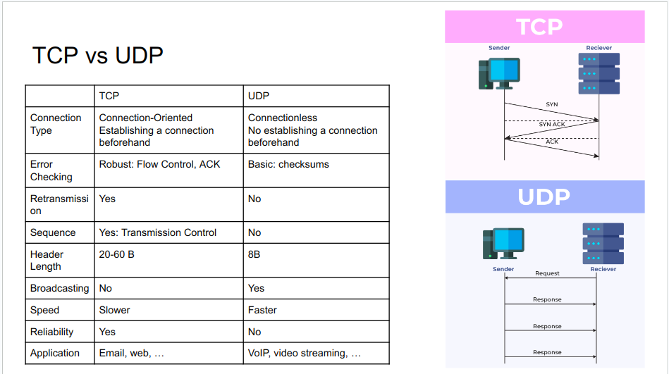

### 1. Types
- Intranet:
  + Connections inside an organization
  + Any services within an intranet are restricted
  + These services remain private and inaccessible 
from the Internet.
  + Example: network in a bank

- Extranet:
  + Extends intranet
  + Connects to partners, customers, …
  + Example: a bank connects to a merchant partners via leased lines

- Internet:
  + Services that are publicly available or computer outside of our own networks
  + Internet vs internet?
  + Example: Gmail, Youtube, Facebook, …

### 2. OSI Model

- <b>Physical Layer</b>
  + This layer converts data in the form of digital bits into electrical, radio, or optical signals to create the physical connection between devices.

- <b>Data Link Layer</b>
  + Is responsible for the host-to-host transfers on the same local network
  + Error detection and error correction
  + Identification: MAC (Media Access Control) address
  + Protocols: Ethernet, WiFi, PPP

- <b>Network Layer</b>
  + Transferring data flows from a host on one network to a host on another network
  + Unreliable
    - Delivery of packets
    - In-order packets
    - Integrity of data
  + Identification: IP Address 
  + Protocol: IP

- <b>Transport Layer</b>
  + Transferring data between applications/processes
  + Providing reliable data transfer services to the upper layers
    - Flow Control
    - Segmentation
    - Error Control
  + Identification: Port. There might be many processes receiving or transmitting data on an OS, so <b>Port number is needed to distinguish processes.</b>
  + Protocol:  TCP, UDP

- <b>Session Layer</b>
  + Sending and receiving data at the same time
  + Establishing procedures for performing checkpointing, suspending, restarting, and terminating a session
  + Identification: Socket

- <b>Presentation Layer</b>
  + Converting data into a format that applications can understand
  + Encryption: TLS/SSL

- <b>Application Layer</b>
  + Providing application functions for users
  + Protocols: HTTP, FTP, DNS, SMTP, Telnet, …
---
- <b> Question </b>
  + The data that the application need to transmit, might be very large, so it is difficult to transmit directly. What mechanism to handle this situation?

    - Data packet must be divided into blocks, so that even if there is a If a block is lost or corrupted, only that one block needs to be resent instead of the entire packet.

  + Challenge: What identical information to establish a socket?
    - Source IP, Source Port
    - Destination IP, Destination Port
    - Transport Protocol: TCP / UDP

### 3. Encapsulation

### 4. IP
- IP is responsible for communication between two devices not connected directly
- Example: Lang Son – train → Noi Bai Airport – aircraft → HCM
- IPv4: 32 bit, 4 groups of 8 bits are separated by “.”
- Example: 192.168.0.1
- ~ 4.3 billion IPv4 address
- IP address is assigned to network card, a host/device can have multiple IP addresses
→ IPv4 exhausted

### 5. CIDR

### 6. TCP vs UDP

### 7. TSL/SSL Handshake

- <b> Question </b>
  + Why client and server need to change cipher to use a session key?
    - Symmetric encryption is cheaper and faster than asymmetric encryption 

### 8. Network Services
- DHCP Servers
  + Automatically assigns and manages IP addresses and other network configuration settings to devices on a local network

- DNS server
  + Translate human-readable domain names into IP addresses

- Firewall
  + Monitor and filter incoming and outgoing network traffic based on an organization's previously established security policies.

- Proxy Server
  + An intermediary server act as a gateway, forwarding requests and responses between the user and the target server

- FTP Server

### 9. Network Topology

- <b> Question </b>
  + What are roles of the modem in your home network?
    - Router
    - Switch
    - DHCP
    - Firewall
    - Web server

### 10. Read More
- TCP retransmission, sliding window, flow control, congestion control
- NAT
- IPv6
- TLS/SSL Handshake

### 11. References
- [Transport layer security TLS](https://hpbn.co/transport-layer-security-tls/)
- [TLS Handshake explained](https://auth0.com/blog/the-tls-handshake-explained/)