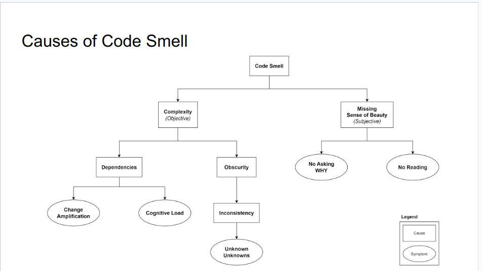
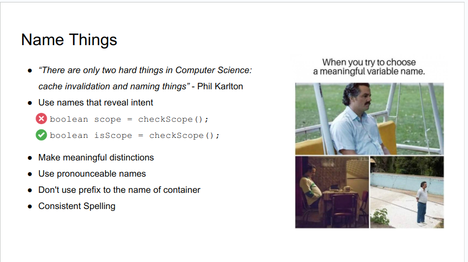
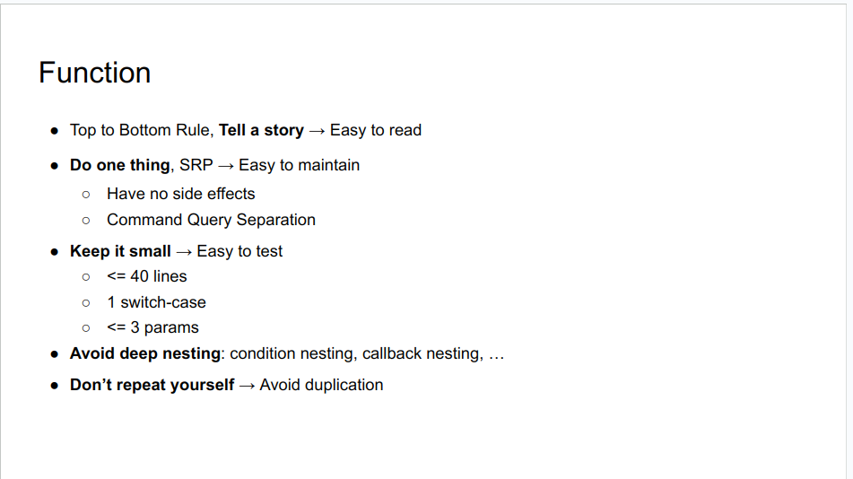
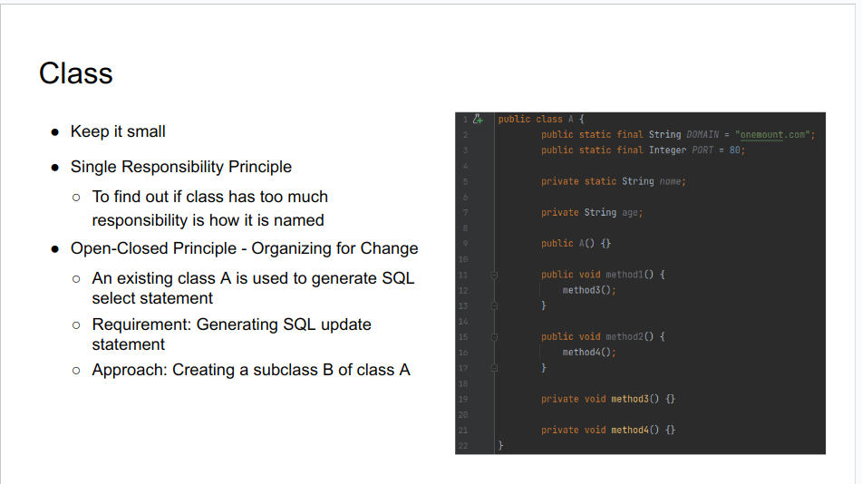
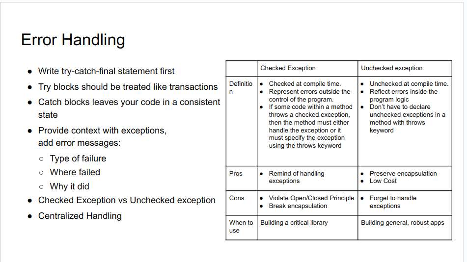
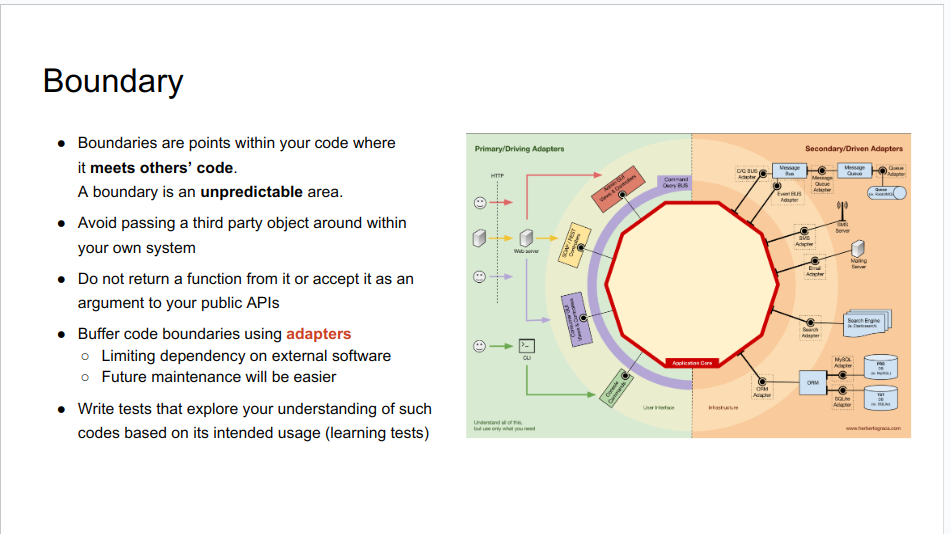
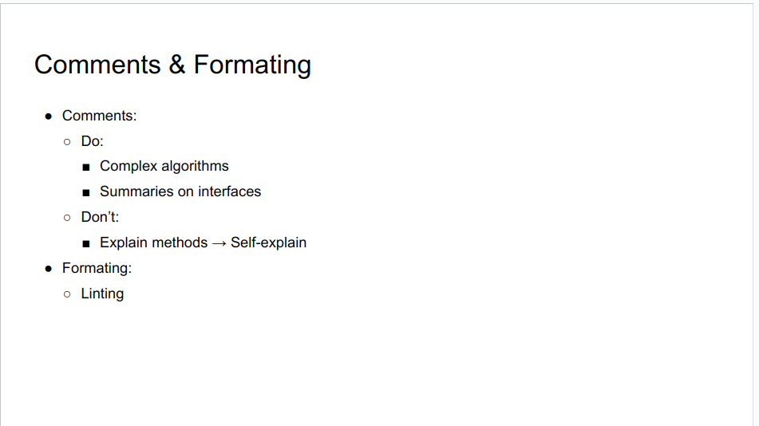
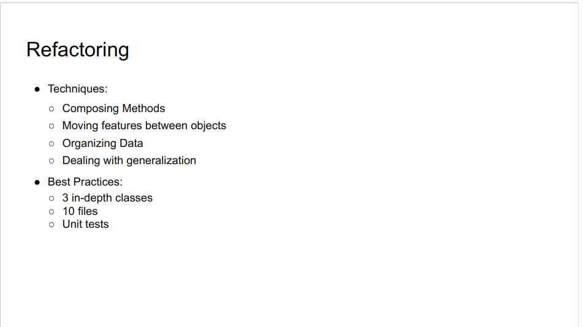

### 1. What is Clean Code?
- Clean code is code that very easy to understand and change

### 2. Objectives/Mindset
- Fourable
  + Readable
  + Maintainable
  + Testable
  + Scalable

- Objectives: same to clean architect
“to minimize the human resources required to build and maintain the required system”

- Trade-offs:
  + Clean Code vs Performance
  + Clean Code vs Speed of Market Delivery

.

### 3. How To Write Clean Code
- Abstract Ways:
  + <b>Easy to understand: </b> Naming, Conventions, Format, Code Review, Static Scanning, …
  + <b>Easy to change: </b> Principles, Design Patterns, Unit Test, Refactoring, …

- Practice Ways:
  + <b>Read</b> -> Got the sense of beauty
    - Codes of others (distinguish clean code vs smell code)  
    - Books (Tech & Non-Tech)
  + <b>Be Disciplined and Be pragmatic</b>
    - Think of objectives, principles and conventions first
  + <b>Practices</b> -> Handle with complexity
    - Understand fundamentals and the domain
    - Fix symptoms 
    - Refactor frequently
    - Pair programming

### 4. Principles
- KISS
  + Break down the problem into small enough or understandable enough pieces
  + Don’t start with over-engineering

- SOLID
  + Single Responsibility Principle
  + Open-Closed Principle
  + Liskov Substitution Principle
  + Interface Segregation Principle
  + Dependency Inversion Principle
  + “If the Open-Closed Principle states the goal of OO architecture, the Dependency Inversion Principle states the primary mechanism”

### 5. Practice

