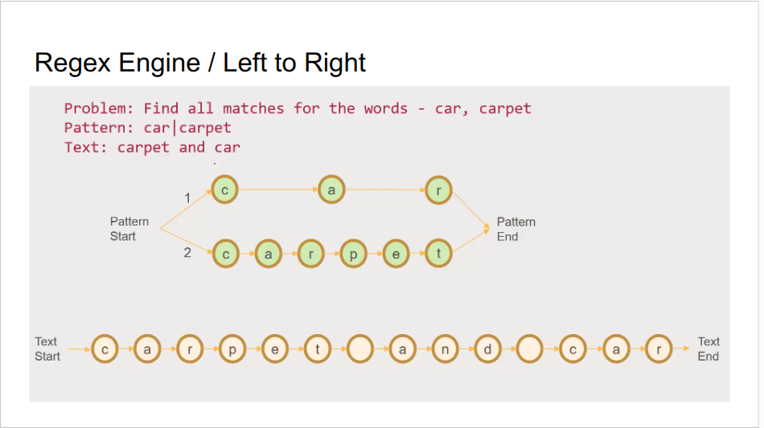
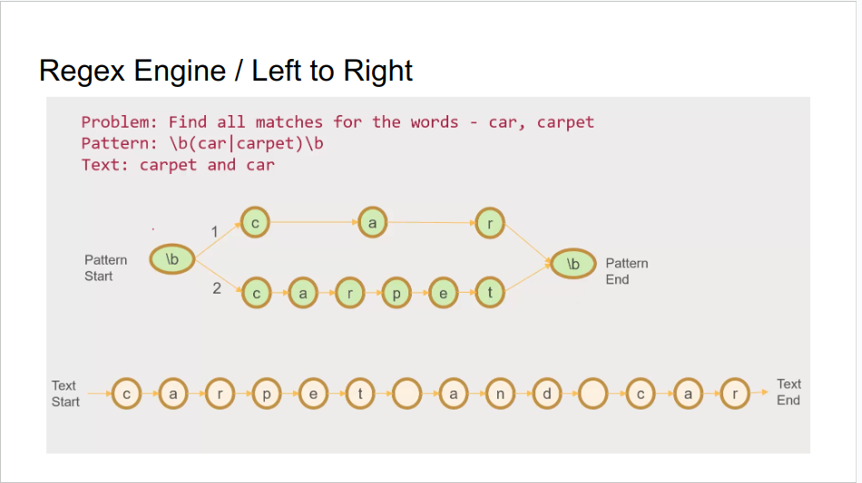
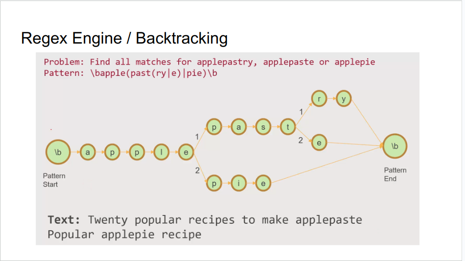

### 1. Regex Language
- Regular expression (regex) is powerful tool for pattern matching within strings.
- Use cases:
  + Data validation
  + Search operations
  + Parsing
  + Text manipulation
- Each language has its own regex engine and they are not the same at all
  + Regex is like a interface
  + Regex engine is like a implementation

#### Matches
+ Input
  - String
  - Regular Expression (Regex)
+ Output
  - Match(es)

+ Example: https://regex101.com/r/nAIn2B/1 

#### Group
- Grouping part of regex
- Use (...) to group
- To name the group: (?<group_name>expression)

- Example: https://regex101.com/r/FiNWUT/1 

#### Alternation
- Match a single regular expression out of several possible regular expressions
- Use | to separate alternatives
- Example: https://regex101.com/r/PXkj2Q/1 

#### Optional Item
- Regex: a|b|c = [abc]
- Range: [a-z], [0-9], [a-zA-Z0-9]
- Example: https://regex101.com/r/3wx3UI/1 

#### Negation
- A character not in the range
- Syntax: [^...]

- Example: https://regex101.com/r/LjCGqB/1  

#### Anchors
- ^: Start of line
  + Ex: https://regex101.com/r/nPuQHa/2 
- $: End of line
  + Ex: https://regex101.com/r/U0MT13/1 
- \b: Word boundary
  + Ex: https://regex101.com/r/HCgJVG/1 

#### Shorthand Class
- \d: any digit. = [0-9]
- \w: any word character. = [A-Za-z0-9_]
- \s: any whitespace character. = [ \t\r\n\f]
- .: any single character
- \\: escape special characters. Ex: [a-z\.]

#### Quantifier
- *: zero or more. https://regex101.com/r/74iagP/1 
- +: one or more. https://regex101.com/r/eP7ASu/1 
- ?: zero or one. https://regex101.com/r/1IvdlG/1 
- {n}: Exactly n times. https://regex101.com/r/6bwjm3/1 
- {n,}: At least n times. https://regex101.com/r/nxTa4l/1 
- {n, m}: From n to m times. https://regex101.com/r/pdXCE2/1 

#### Flags
- g (global): returns all matches, do not return after first match
- i (insensitive): regex is case sensitive by default
- m (multi line): scan on multiple lines
- Example: https://regex101.com/r/Rjl8tu/2 

### 2. Practice
- Cheat Sheets: https://cheatography.com/davechild/cheat-sheets/regular-expressions/ 
- Google for solutions
- Note:
  + Choose the regex engine of javascript 
  + The regex engine of Java works not well
  + If regex on regex101 does not work, then try it on real code

#### Exercise 1: Image File Names
- Find names of image files
- Ex: https://regex101.com/r/mzxKHU/2 
- Ans: "\w+.(jpg|png|jpeg)$"

#### Exercise 2: Number
- Find numbers
- Ex: https://regex101.com/r/cO5Bsk/3 
- Ans: ^ [0-9.,]+$

#### Exercise 3: Emails
- Validate email
- Ex: https://regex101.com/r/xWQka4/2 
- Ans: ^ [\w.]+@[\w-]+(\.\w+)+$

#### Exercise 4: Network Configuration
- Extract network configurations
- Ex: https://regex101.com/r/ubTXiV/1 
- Ans: interface (?<interface>.+)\sstatus (?<status>\w+)\sip address (?<ip00>[0-9. ]+)\s(ip address secondary (?<ip01>[0-9. ]+))?

#### Case Study 1: Transform logs into CSV
- Ex: https://regex101.com/r/OxMoHy/1 
- Use VScode
    + Step 1: ^((?!voucher).)*$
    + Step 2:   INFO.+User
    + Step 3:  claimed voucher

#### Challenge
- Ex: https://regex101.com/r/Tcgfo2/1 
- Passport number and citizen id is the same pattern
- Allow to google
- Not allow to ask ChatGPT
- Hint: Apply an operation that is not taught yet

#### Look around
- Look ahead: what is coming up next without consuming the characters
    + Example: https://regex101.com/r/fBhwIN/1 
- Look behind: what came before current character
- IF condition THEN expression

### 3. Regex Engine
- One character at a time
- Left to right
    + Regex Engine use backtracking to evaluate other paths
- Greedy, Lazy
    + Quantifier *, + are greedy. They try to match as much of input text as possible
    + Lazy matches as few times as possible and attempts to match rest of patterns
    + Turn to lazy by adding ? after the quantifier
- Look around

### 4. Best Practices
- Use The Dot Sparingly. The regex also matches in cases where it should not match
- Use Negated Character Classes Instead of the Dot
- Group capture is expensive → non-capturing group (?:)
- Avoid exponential. Ex: ^(\w*)*$
- Add a timeout to against unexpected scenarios (if possible)
- Compile regular expressions once
- Avoid Making Everything Optional. It is more important to consider what it should not match, than what it should

### 5. Homework
- Game
    + https://regex101.com/quiz/1
    + https://regex101.com/quiz/3
    + https://regex101.com/quiz/6
    + https://regex101.com/quiz/12

- Find duplicate lines 
    + Remove all duplicate lines
    + Leave the first of duplicate lines and remove the rest
U123
U234
U452
U341
U123
U789
U1092
U109
U2342
U1092
U603
U745

