### 1. Architectural Patterns
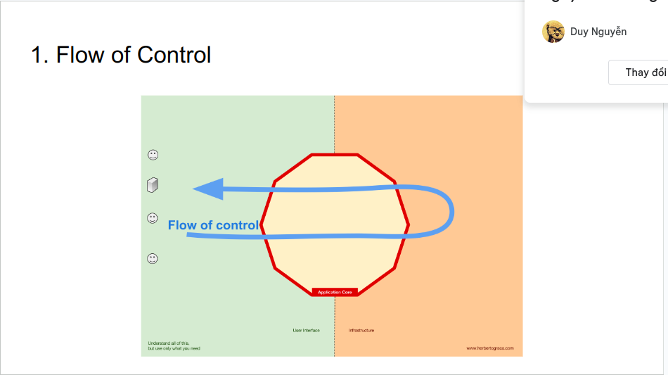

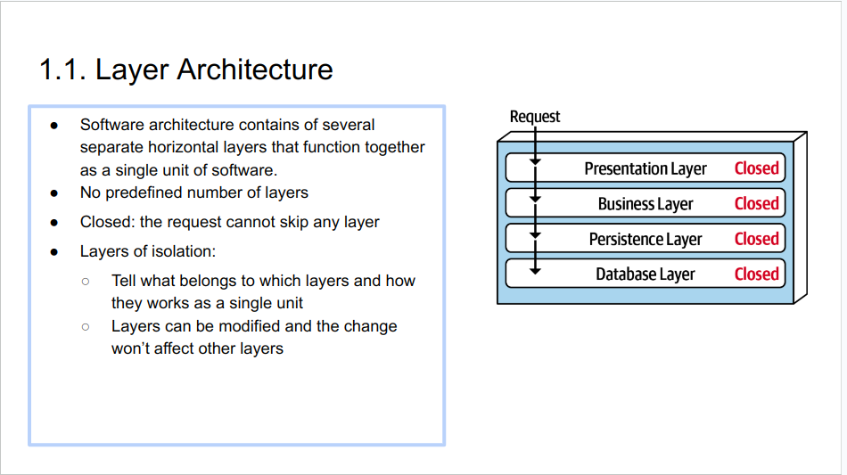

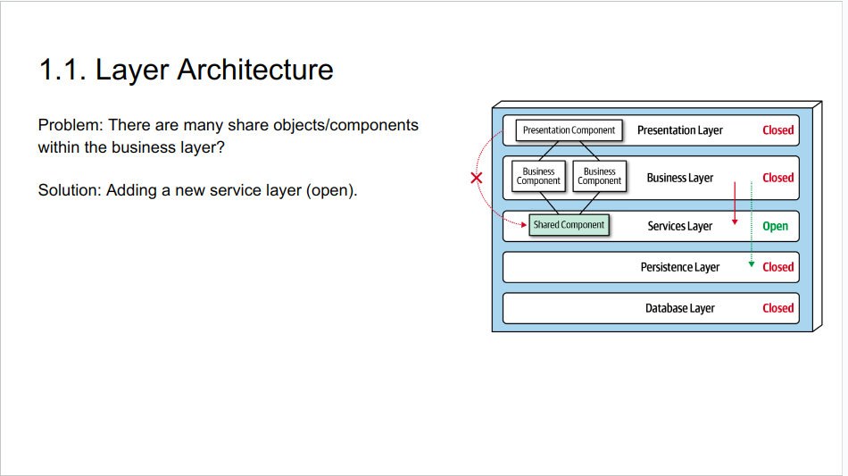

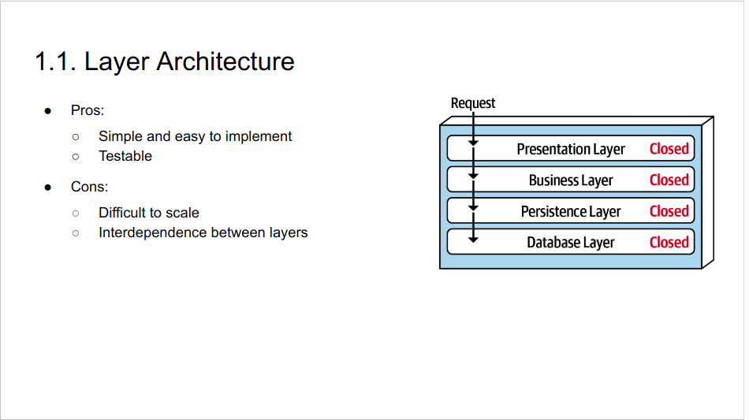

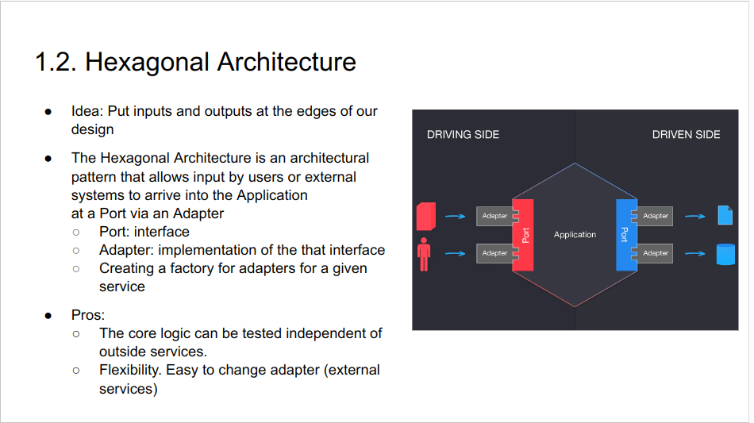

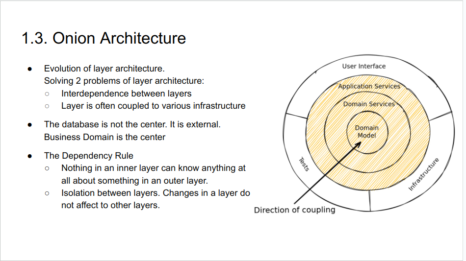

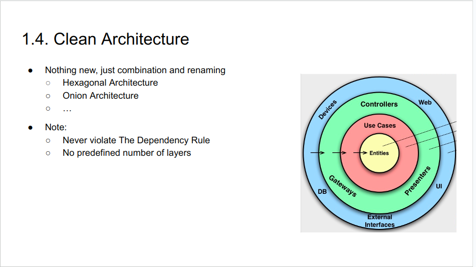

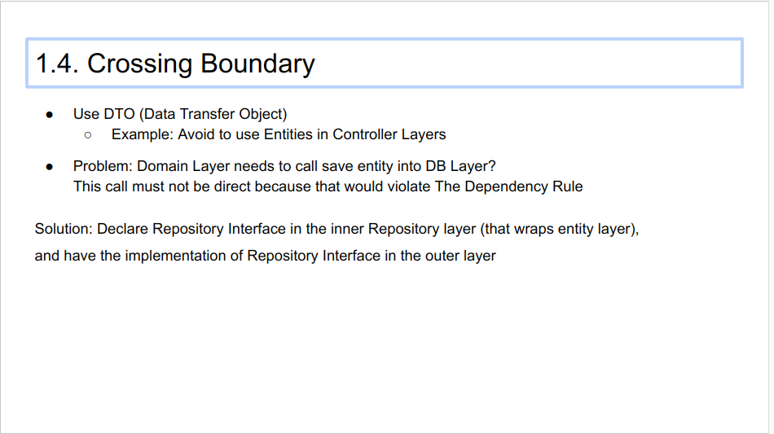

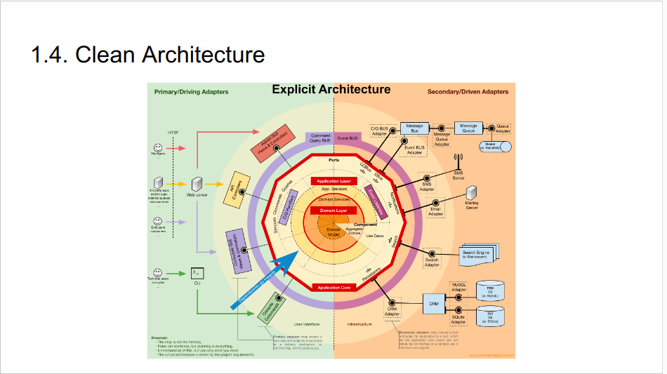

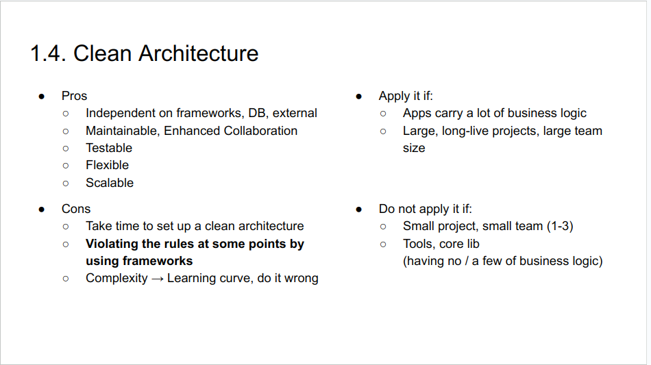

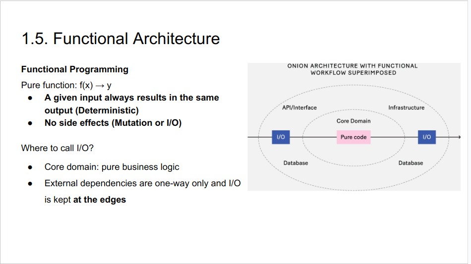

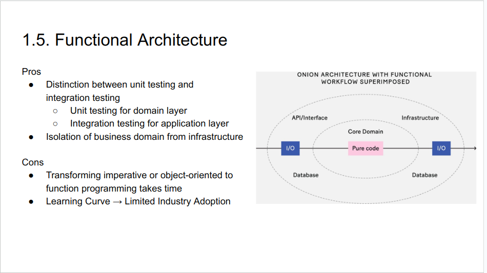

### 2. Domain Driven Design
#### Introduction
- Domain-Driven Design is an approach to software design that glues the system’s implementation to <strong>a constantly evolving model and business problems</strong>, leaving aside irrelevant details like programming languages, infrastructure technologies, etc…

- Under domain-driven design, the structure and language of software <strong>code (class names, class methods, class variables) should match the business domain</strong>

- It is also a working methodology

#### Bounded Context
- A bounded context is a grouping of related functionality, components and concepts.
- Within the context, we share a common language
    + Example 1: a “letter” could mean 2 very different things
        + Post office: a message written on paper
        + Education: a character
    + Example 2: credit could have 2 meanings 
        + Lending: the ability of a customer to obtain goods or services before payment, based on the trust that payment will be made in the future.
        + Payment: the account receiving money
- Bounded contexts can continue operating independently

#### Collaborative Modeling
- Developers collaborate with domain experts to refine the Domain Model
- Force developers understand business problem
- To collaborate effectively between business and technical teams
→ Ubiquitous Language
- Ubiquitous Language will be embedded in the code.

#### Tactical Design
- Entity
    + Entity is an object that has ID and lifecycle
    + For example: order

- Value Object:
    + Value objects describe characteristics, dont have ID and immutable
    + For example: Address, Configuration

- Aggregate
    + An aggregation of Entities and Value Objects to restrict the violation of business invariants

- Service
    + Service should be stateless

- Repository
    + All repository interface definitions should reside in the Domain Layer, but their concrete implementations belong in the Infrastructure Layer.

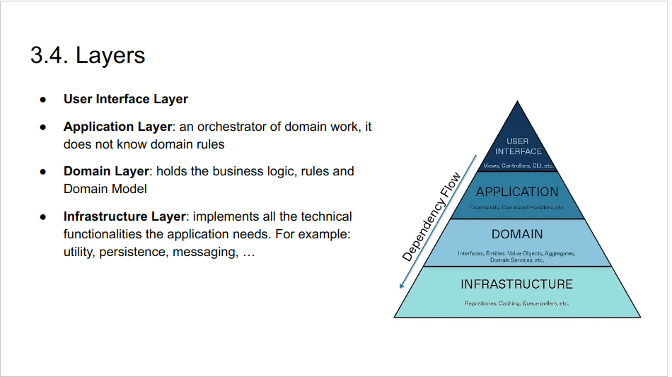