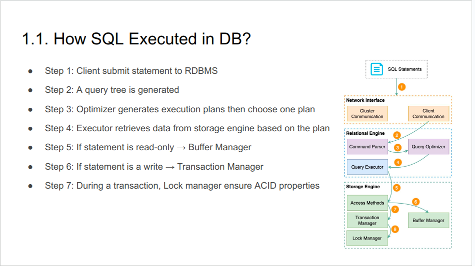
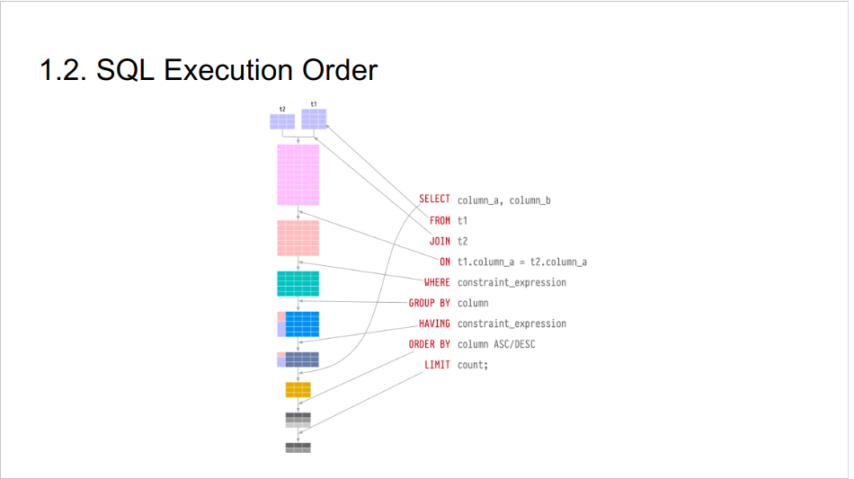
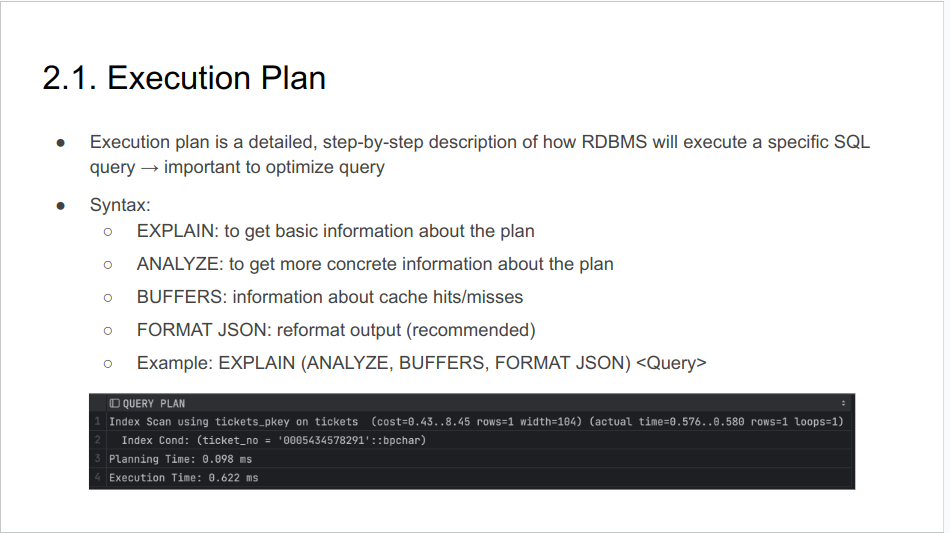
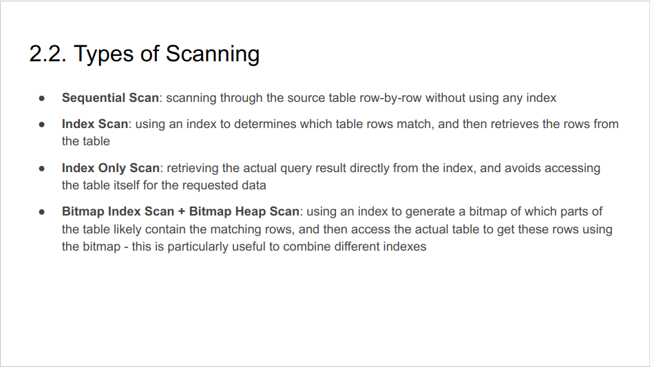
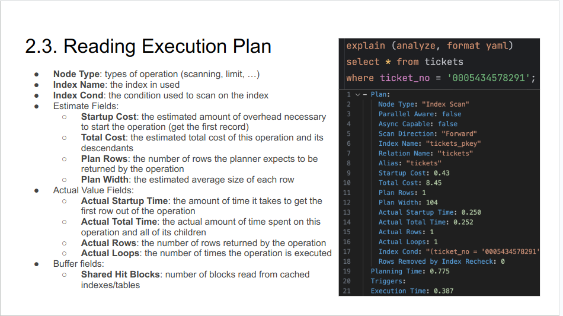

### 1. SQL Execution

### 2. Execution Plan

### 3. Practices
#### Notes before practices
- PostgreSQL does not have a cache optimization. There is OS cache may affects but it is trivial
- No way to show all candidate plans, they are removed right after optimizer planning
- With PostgreSQL, LIKE does not use index

####  Key Takeaways
- Do not reply on framework, lib to generate SQL
- Btree for range query, Hash for equal query
- Index is suitable for fetch a small number of records
- Use multi-column indexes, but sparingly
- Ordering matters
- Leverage covering index (by using the INCLUDE for PostgreSQL)
- Be careful with function
- PostgreSQL and MySQL do not work the same
- Optimization in depth using pg_stat_statemements https://www.postgresql.org/docs/current/pgstatstatements.html 