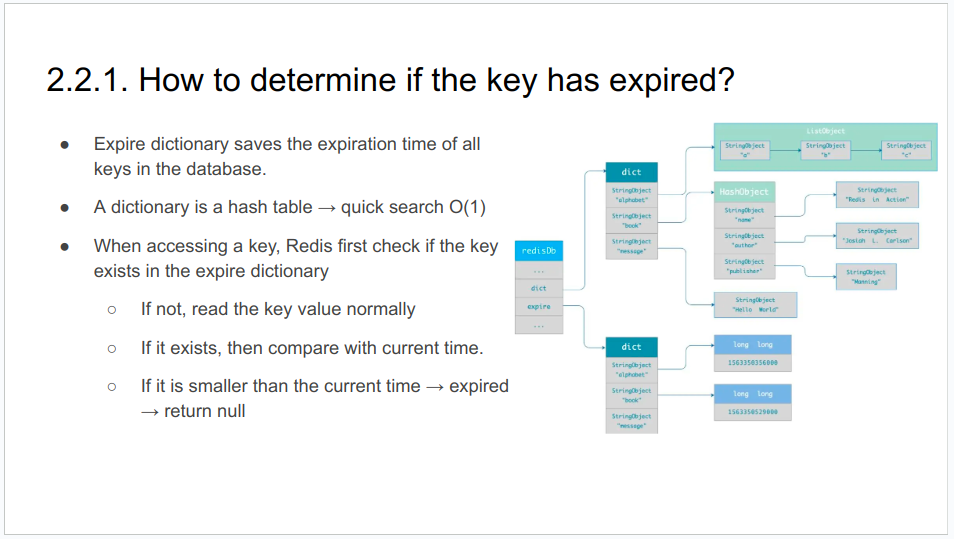

### 1. Introduction
#### 1.1 Definition
- Redis is an open-source, in-memory database.
- Redis provides a variety of data structures to support different business scenarios.
- Redis also supports many features: transactions, persistence, Lua scripts, multiple cluster solutions, publish/subscribe mode, memory elimination mechanism, …
- Use cases: caching, key-value database, message queue, …

#### 1.2 Redis vs Memcached
- Similarities:
    + In-memory databases and generally used as cache.
    + Expiration policies
    + High performance
- Differences:
    + Redis is better on <strong>read operations and memory use. </strong>
    + Memcached is better on write operations.
    + Redis supports <strong>more data structures</strong>.
    + Redis supports <strong>data persistence</strong>. Memcached does not.
    + Redis supports <strong>cluster mode</strong>. Memcached does not.
    + Redis provides <strong>other features</strong>: transaction, pub/sub, lua script, …

#### 1.3.1. Architecture / Master-Slave
- Replication: Data is written to a main instance. The main instance sends copies of those commands to a replica.
- Pros:
    + Scale reads
    + Failover 
- Cons:
    + Data inconsistency
    + Master/slave server goes down, <strong>it needs to be restored manually</strong>

#### 1.3.2. Architecture / Sentinel
- Sentinel mode can monitor the master and slave servers
- In addition, sentinel node serves a role in service discovery
- Pros:
    + Failover
- Cons:
    + Data inconsistency
    + <strong>Cached data is so large that one server cannot cache it</strong>

#### 1.3.3. Architecture / Cluster
- Distributes the data on different servers
- Pros:
    + Reduce the system's dependence on a single master node
    + Improve read and write performance
- Cons:
    + Data inconsistency
- Choose one of modes:
    + Master-Slave
    + Sentinel
    + Cluster (recommended)

- Hash Slots handle the mapping relationship between data and nodes
- A cluster has a total of 16384 hash slots
- Even distribution on nodes in a cluster
- One hash slots can have multiple keys

### 2. How Redis Works?
#### 2.1. Why is Redis So Fast?
- <strong>In-Memory</strong>
- <strong>Single Thread Model</strong>
    + Multi-threading app require locks or other synchronization mechanisms → complexity, bug prone → difficult to gain performance
    + CPU is not the bottleneck. In most cases, it is limited by memory size and network I/O.
- <strong>Multiplexing</strong>
- <strong>Efficient Data Structures</strong>

#### 2.2. Data Persistence
##### 2.2.1. AOF (Append Only File)
- Pros:
    + Avoid additional checking overhead
    + Do not block the execution of the current write operation command
    + Less data loss
- Cons:
    + Data loss
    + May <strong>block other operations</strong>
    + If too many AOF logs → <strong>slow recovery</strong>

##### 2.2.2. RDB (Redis Database)
- 2 ways to generate RDB files:
    + Save command: RDB is generated in the main thread → blocking the main thread
    + Bgsave command: a child process generates RDB → avoid blocking the main thread
- Pros:
    + Fast Recovery
- Cons:
    + Data loss
    + A relatively heavy operation

##### 2.2.3. Hybrid
- Pros:
    + Less data loss
    + Fast recovery
- Cons:
    + Poor readability
    + Poor compatibility. Hybrid persistence AOF file cannot be used in versions prior to Redis 4.0

#### 2.3. Expired Deletion

##### 2.2.2. What are the expiration deletion strategies?
- <strong>Passive Way</strong>: Key is not deleted immediately right after expiration. When the key is accessed, it detected if the key has expired. If it expires, then delete the key asynchronously.
    + → Problem: some keys is never accessed after they are created → memory space wasted
- <strong>Active Way</strong>: Periodic job (activeExpireCycle): 10 times/s
    + Randomly select 20 keys from the expired dictionary
    + Check whether these 20 keys have expired and delete the expired keys
    + If the number of expired keys exceeds 25% of the number of randomly selected keys, continue to repeat step. If it does not, then the current job stops and wait for the next round
→ Problem: if the active job is long, active job will block other requests.
→ Set timeout for active jobs

- <strong>Combine 2 ways: passive way + active way</strong>
- <strong>Problem:</strong> Finding expired keys is not effective
- <strong>New Approach:</strong> Expiration of keys is stored in a Sorted Set (ZSET) → find expired keys more effectively

### 3. In Practices
#### 3.1. Data Structures
##### 3.1.1. String
- Implementation: SDS (Simple Dynamic String)
    + SDS can save not only text data, but also binary data
    + SDS is safe, concatenating strings will not cause buffer overflow

- Applications
    + Cache objects (JSON)
    + Count
    + Share session
    + Distributed Lock*

##### 3.1.2. List
- List is a simple list of strings, sorted in insertion order. Elements can be added to the head or tail of List. 
- Applications
    + Store list of elements
    + Message Queue

- Limitation:
    + The maximum length of List is 2^32 - 1
    + List does not support multiple consumers
    + Weak order preservation

##### 3.1.3. Hash
- Implementation: hash table
- Applications
    + Storing objects if frequently access or update attributes in objects
    + Shopping cart
        - Add item: HSET cart:{user_id} {product_id} 1
        - Increase Quantity: HINCRBY cart:{user_id} {product_id} 1
        - Total number of items: HLEN cart:{user_id}
        - Delete item: HDEL cart:{user_id} {product_id}
        - Get all items in the shopping cart: HGETALL cart:{user_id}

##### 3.1.4. Set
- Set is an unordered and unique set of key values, and its storage order will not be stored in the order of insertion.
- Implementation: hash table
- Applications:
    + Deduplication of data and ensuring the uniqueness
    + Function on sets: difference, union and intersection
    + Likes, common followers, …
- Limitations:
    + Max: 2^32-1 elements
    + The calculation complexity of functions on sets is relatively high. → block the main thread

##### 3.1.5. Sorted Set (ZSET)
- Set is an ordered and unique set of key values, and its storage order will not be stored in the order of insertion.
- Implementation: Skip List
- Applications
    + Leaderboard
    + Sorting

#### 3.2. Practices
##### 3.2.1. How to implement a delay queue?
- Context: When taking a taxi, if there is no car owner to take the order within the specified time, the platform will cancel your order and remind you that there is no car owner to take the order at the moment
- Use an sorted set (ZSet)
- Add element:
    + Value: order_id
    + Score: expiration time
- Poll to get expires order

##### 3.2.2. How to deal with big keys in Redis?
- Big key:
    + The value of type String is greater than 10 KB
    + The number of elements of Hash, List, Set, and ZSet types exceeds 5000
- Drawbacks:
    + Time-consuming
    + Network congestion
    + Block the worker thread when deleting
    + Memory is unevenly distributed

- Approach:
    + Use the SCAN, HLEN, SCARD command to find the big key
    + Asynchronous Deletion

##### 3.2.3. How to put different keys on a node?
- Problem: 
    + Functions on 2 sets on 2 different nodes → does not work
    + 2 sets in the same hash slot → works
- Use Hashtag
    + User_profile:{34}
    + User_session:{34}

##### 3.2.4. How to implement distributed locks?
- Problem: 
    + Make sure order
- Use SETNX
- Example: 
    + SET lock_key value NX PX 10000
    + DEL lock_key

##### 3.2.5. Best Practices
- Run Redis cluster
- Leverage multi get, pipelines
- Avoid long-run tasks
- Normally set short TTL
- Distribute TTL → avoid thundering herd
- Pick right data structures
- Leverage hashtag

### 4. Recap
- A cluster has a total of 16384 hash slots. Data is distributed into hash slots.
- CPU is not the bottleneck. Single thread model makes sense
- Leverage data structures and features. Specially care about distributed lock 

### 5. References
- [Redis Anti-Patterns Every Developer Should Avoid](https://developer.redis.com/howtos/antipatterns/)
- [7 Redis Worst Practices](https://redis.com/blog/7-redis-worst-practices/)
- [Redis Explained](https://architecturenotes.co/redis/)