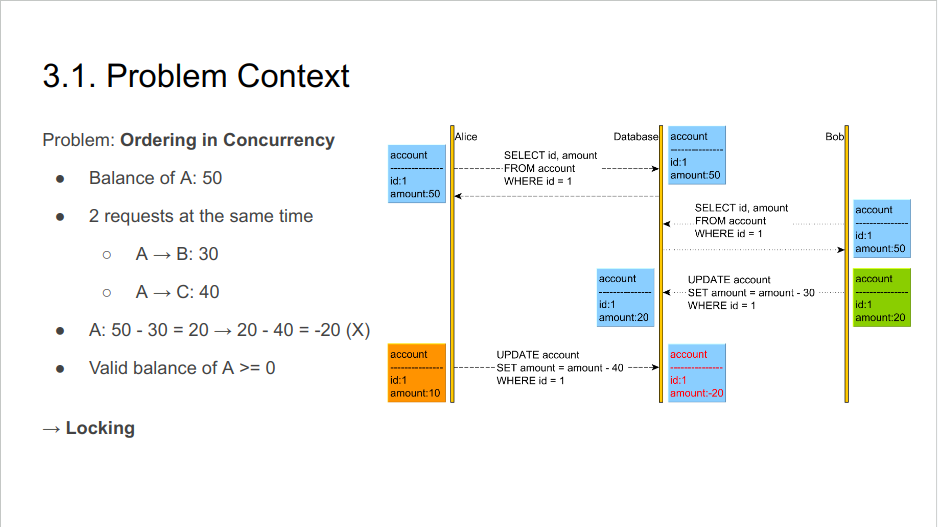
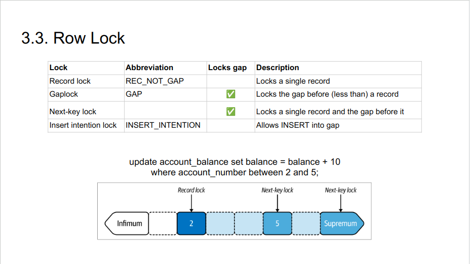
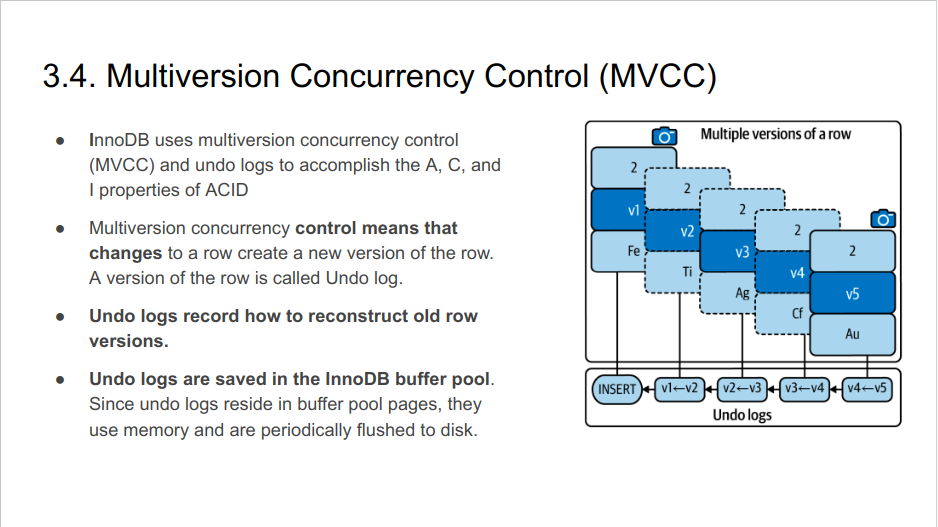
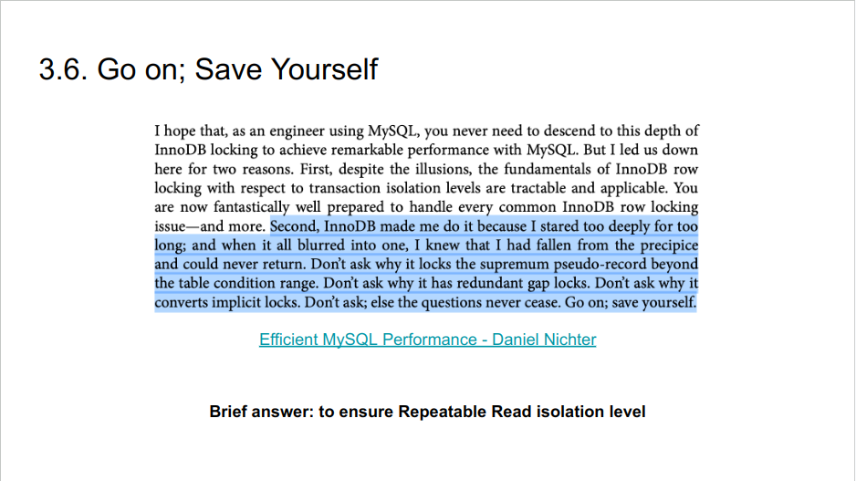
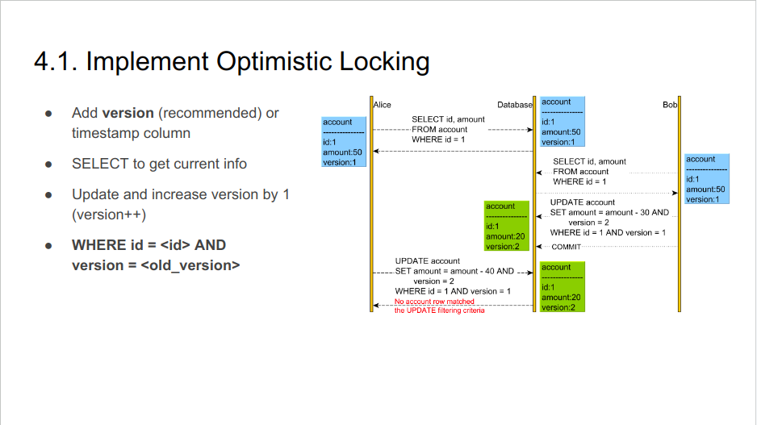

### 1. Introduction

#### 1.1. Definition
- A transaction is a group of SQL queries that are treated atomically, as a single unit of work.
- All or Nothing
- Syntax:
    + START TRANSACTION: start transaction
    + COMMIT: Apply changes
    + ROLLBACK: Discard the changes

#### 1.2 ACID
- ACID are properties of transaction in SQL DB
- Atomicity: a group of SQL queries is like a query. <strong>all or nothing.</strong>
- Consistency: The database should always move from one consistent state to the next. If one query crashes, it <strong>doesn’t result in information, data disappearing.</strong>
- Isolation: The results of a transaction are usually <strong>invisible</strong> to other transactions until the transaction is complete.
- Durability: Once committed, a transaction’s changes are permanent. The changes, the data <strong>won’t be lost in a system crash.</strong>

### 2. Isolation Levels

#### 2.1. Read Uncommitted
- Transactions can view the results of uncommitted transactions
    + → Problem: Read Dirty
    + → Buggy, rarely used in practice

#### 2.2. Read Committed
- Transactions can view the results of committed transactions
- Solve the Read Dirty problem
    + → Problem: Non-repeatable read - get different value on re-read of a row if a concurrent transaction updates the same row and commits

#### 2.3. Repeatable Read
- Repeatable Read guarantees that any rows a transaction reads will “look the same” in subsequent reads within the same transaction
- Solve the non-repeatable read problem
    + → Problem: Phantom Read - get different rows after re-execution of a range query if another transaction adds or removes some rows in the range and commits.
    + A new row appears without knowing where it comes from. It sounds like a phantom.

#### 2.4. Serializable
- SERIALIZABLE solves the phantom read problem by forcing transactions to be ordered so that they can’t possibly conflict
- In a nutshell, SERIALIZABLE places a lock on every row it reads
    + → Problem: Decreasing concurrency
    + Serialize is rarely used in practice.

### 3. Locking

#### 3.2. Types of Locks in MySQL
- Classified based on row-level:
    + Global Lock
    + Table Lock
        - Lock table. Example: lock tables <table_name> read
        - Intention Lock
        - AUTO-INC lock is a special table lock mechanism
    + Row Level
        - Record lock
        - Gap lock
        - Next-Key lock
        - Insert Intention lock

- Classified based on operation-level:
    + <strong>Shared</strong>: Allow to read but lock to write
    + <strong>Exclusive</strong>: Lock to read and write

#### 3.7. Pessimistic Locking vs Optimistic Locking
- <strong>Pessimistic Locking</strong>: to avoid conflicts by <strong>using locking</strong>
    + Pros
        - Data Integrity
    + Cons:
        - <strong>Concurrency Bottlenecks</strong>
        - Potential Deadlocks
- <strong>Optimistic Locking: no locks,</strong> allows a conflict to occur, but it needs to <strong>detect, resolve it at write time.</strong>
    + Pros:
        - Reduced Lock Overhead → Higher Concurrency
        - Avoid Deadlocks
        - Do not affect other clients
    + Cons:
        - <strong>Risk of Conflicts</strong>. If handling multiple requests concurrently, then just one request will be processed, others will be rejected.
        - Complex Conflict Resolution.

### 4. Practices

#### 4.2. Notes
- In MySQL, the default transaction isolation level is Repeatable Read.
- Set transaction isolation level apply the next transaction only. After the next transaction, subsequent transactions use the default transaction isolation level.
- In MySQL, Auto transaction, Autocommit is enabled by default.

#### 4.3. Best Practices
- <strong>Subtract first, add later</strong>
- Use record lock by leveraging primary key
- Avoid to use secondary index in UPDATE
- Avoid large transaction
- Avoid long-running transaction
- Avoid stalled transactions (waiting too long after start, between queries)
- Alert on History List Length
- Examine row locks
- <strong>Leverage Optimistic Locking</strong>
- <strong>Combine Pessimistic Locking + Optimistic Locking</strong>

### 5.Recap
- Each isolation level solves the problem of the previous level. Read Committed and Repeatable Read are used in practice.
- When mention to ordering, remember locking and queue
- Normal Transactions (using Pessimistic Locking) are quite costly. Leverage Optimistic Locking.

### 6. References
- [Use your database to power state machines](https://blog.lawrencejones.dev/state-machines/index.html)
- [Optimistic vs. Pessimistic Locking](https://vladmihalcea.com/optimistic-vs-pessimistic-locking/)