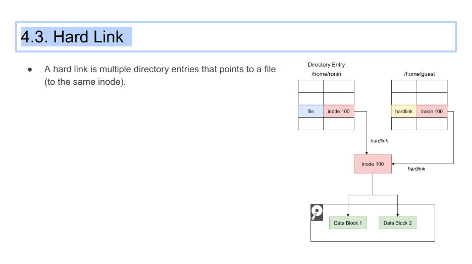

### 1. Kernel

#### 1.1. Introduction
- The core of the operating system is the kernel.
- <strong>A bridge between applications and hardware devices.</strong>
- Applications only need to care about interacting with the kernel.
- Kernel is programs.
- <strong>The kernel has very high permissions</strong> and can control hardware such as <strong>CPU, memory, hard disk, etc.</strong> While applications have very small permissions.

#### 1.3. What Capabilities Does the Kernel Have?
- Manage processes and threads
- Manage memory
- Manage hardware devices
- Provide system calls. If the application wants to run services that run with <strong>higher privileges, then a system call</strong> is required

#### 1.4. Linux Design
- MultiTask: multiple tasks can be executed at the same time
- SMP (Symmetric Multiprocessing): each CPU has an equal status and has the same rights to use resources.
- ELF: Executable File Link Format. is the storage format of executable files in the Linux operating system
- Monolithic Kernel (Macro kernel): all modules of the system kernel run in the kernel state.

### 2. Memory Management

#### 2.1. Virtual Memory
- Problem: Two programs in memory at the same time. The first program writes a new value at location 0x00002000. The second program overwrite value at that location → Conflict
- Solution: <strong>Virtual Memory</strong>
    + Virtual Memory Address: each program has its own virtual address space
    + Physical Memory Address: the address space exists in the hardware actually
    + The virtual address is converted into a physical address using the Memory Management Unit (MMU) in the CPU chip.
    + Virtual Memory = Physical Memory + Swap memory (hard disk memory)
    + Each process has <strong>its own page table</strong> → Solves the problem of address conflicts
    + A process can <strong>use more running memory than the physical memory size.</strong>
    + Entries in the page table also have some bits that mark attributes, such as controlling the read and write permissions of a page → better security
- Problem: Out of Mem → Reclaiming memory.
- For those memories that are not frequently used, we can Swap it out outside of physical memory, such as the swap area on the hard disk.
- → Performance impacts

### 3. Process Management

#### 3.1. Concepts
- <strong>Program</strong>: An <strong>executable file</strong> that contains code and is stored as a <strong>file on disk</strong>
- <strong>Process</strong>: When we <strong>run the program file</strong>, it will be loaded into memory and CPU will execute each instructions in the program
- <strong>Thread</strong>: A thread is an execution <strong>flow within a process</strong>.

### 4. File System

#### 4.1. Introduction
- The file system is the subsystem of the OS responsible for managing persistent data.
- In Linux, "Everything is a file."
- File descriptor is the identifier of the open file

#### 4.2. Inode
- Index nodes (Inodes) are used to record meta-information of files, such as inode number, file size, data location on disk, etc. 
- The index node is the unique identifier of the file.
- Directory entries are used to record file names, index node pointers, and hierarchical relationships with other directory entries.

### 5. Network

#### 5.1. How Many Connections Can a Server Serve?
- It will be mainly limited by two aspects:
    + <strong>File descriptor</strong>: The default value is 1024, but we can increase the number of file descriptors 
    + <strong>System memory</strong>: each connection will occupy a certain amount of memory
- Context switching between processes is heavy → model: thread/connection.
- If threads are frequently created and destroyed, the system overhead will be considerable.

### 6. Linux Commands

#### 6.1. Common Commands
- head: shows the first lines of a file
- tail: shows the last lines of a file
- sed: stream editor
- awk: it's a programming language designed for text processing.
- curl: a tool to make HTTP requests.
- wget: a tool for retrieving files using HTTP, HTTPS , or FTP.

#### 6.2. Shell
- Shell: command-line
- Bash shell is the default shell in Linux
- Exercise 1: Replace env var in a manifest file
- Exercise 2: Rename image files with date prefix

### 7. Recap
- System call (Kernel Mode) is costly
- Context switch is costly
- In Linux, everything is file. Sequential I/O >> Random I/O
