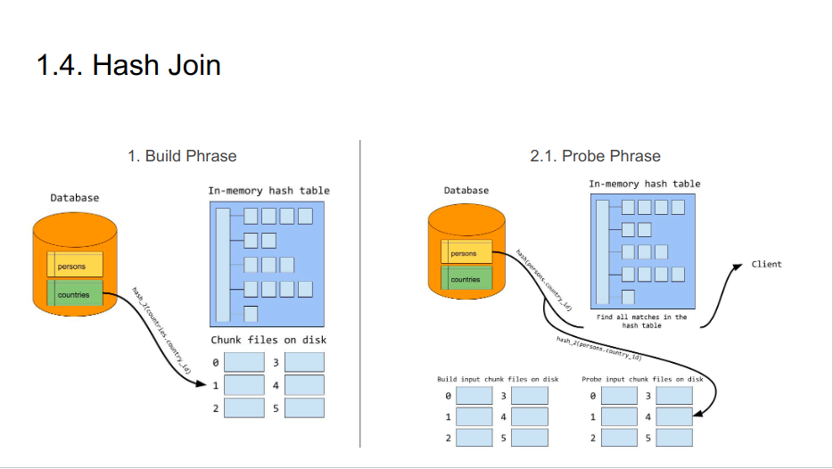

### 1. Join
#### 1.1. Nested-Loop Join

```sql
FROM t1 
JOIN t2 ON t1.A = t2.B
JOIN t3 ON t2.B = t3.C
```

- Nested-Loop Join is a default algorithm
```js
func find_rows(table, index, conditions) []rows {
    // Return array of rows in table matching conditions,
    // using index for lookup or table scan if no index matches
}

foreach find_rows(t1, some_index, "WHERE ...") {
    foreach find_rows(t2, index_on_B, "WHERE B = <t1.A>") {
        return find_rows(t3, NULL, "WHERE C = <t2.B>")
    }
}

```

#### 1.2. Block Nested-Loop Join
- Problem: Assume t1 and t2 have 10 matching rows, then t3 is accessed 100 times
- Solution: matching rows in t1 and t2 are save in a join buffer.
- Although the join buffer is accessed many times (for each t3 row), it’s fast because it’s in memory
- System variable: join_buffer_size

#### 1.3. Merge Join
- Sorting rows first → find matching rows → stop at the threshold
- Problem: sorting is costly → rarely in used

#### 1.4. Hash Join
- In MySQL 8.0, the hash join algorithm replaces the block nested-loop join algorithm.
- Hash join create an in-mem hash table
- Hash Join has 2 phrase
    + Build phrase
    + Probe phrase





#### 1.6. Join vs Subquery
- In most cases, Join is faster than Subquery
- Subquery sometimes is faster than Join
    + Subquery return tiny result set (< 100 rows, it depends) and there is one filtering condition does not take effect of indexes
    + After join, query handle distinct (deduplicate).
- There is no rule for this. Try both and explain analyze to verify.

### 2. Partition
#### 2.1. Introduction
- Partitioning is splitting the actual data down into separate tables but still gets treated as a single table.
- 2 types of partitioning:
    + Vertical Partitioning
    + Horizontal Partitioning
- All SELECT, UPDATE, and DELETE should include the partition column in the WHERE clause
- Limitations (MySQL):
    + 1024 partitions / table
    + Any primary key or unique index must include all columns in the partitioning expression

#### 2.2. Benefits
- Enhanced Query Performance: minimizing the amount of data scanned
- Optimized Resource Utilization: Partitioning enables parallelism in query execution across partitions
- Archiving and Deletion
- Streamlined Maintenance
- Scalability

#### 2.3. Partition Key
- Data Distribution
- Analyzing Access Patterns
    + Single row
    + Range ordered rows
    + Random rows

#### 2.4. Types / Partition Strategy
- RANGE: based on a specified range of column values like dates or numeric intervals
- HASH: based on hashing
- LIST: based on predefined value lists rather than the contiguous ranges of values used in range partitioning.
- COLUMNS
- KEY

#### 2.6. Best Practices
- Choose the Correct Partition Key.
- The chosen partition key is part of the primary or unique key.
- For archiving historical data, consider range-based on time.
- High-write workloads might favor hash or key partitioning for load balancing.
- Partitioning if needed
