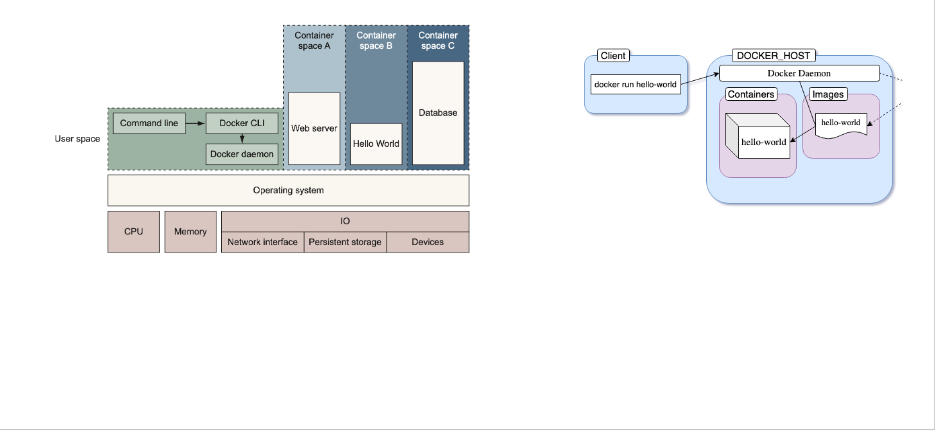

### 1. Introduction
#### 1.1. Problem

- To run app, we need the code, environment (runtime, os, system lib, configurations)
- Setting up environment is painful, resource waste.
-> Container

#### 1.2. Container
- A container is a <strong>standard</strong> unit of software that <strong>packages up code and all its dependencies</strong> so the application runs quickly and reliably

#### 1.4. Container vs Docker 
- Container:
    + Is an running instance on Container Engine
    + <strong>Container Engine is a layer, an interface.</strong>
    + Container Engine is a background service that manages and runs containers.
- Docker:
    + <strong>Is an implementation of the Container Engine interface.</strong> There are other implementations such as containerd, cri-o, but Docker Engine is the most popular one.
    + Docker contains other tools for container management, orchestration such as Desktop GUI, Volumes, Docker Swarm, …

### 2. Workflow
#### 2.1. Workflow 
- Image is a lightweight, standalone, executable package that includes everything needed to run an application: code, runtime, system tools, system libraries and settings.
- Example
    + Image: an app, clock without battery
    + Container: a process, a running clock
- Ways to build image:
    + Dockerfile
    + Docker Commands / Manual

#### 2.2. Writing Dockerfile 
- A Dockerfile is a text file with a series of commands to build image. File name: Dockerfile
- FROM: define the base image, reuse public image. Note: there are multiple stages, each stage can have FROM
- RUN: command will be run when building image
- WORKDIR = cd
- EXPOSE: tell Docker that containers should listen on this port
- CMD: command will be run when the container is started up.

- COPY vs ADD
    + COPY: copy files/directories into an image
    + ADD: same to COPY, but also copy files from a URL
    + COPY is recommended
- CMD vs ENTRYPOINT
    + If there are multiple CMDs, the last CMD is chosen.
    + ENTRYPOINT looks similar to CMD. But ENTRYPOINT sets default parameters that cannot be overridden while starting container.
    + In shell form, ENTRYPOINT ignore the following CMD.
    + ENTRYPOINT is recommended (my point of views)

#### 2.3. Building Image
- $ docker build <Path to Dockerfile> [-t <image-name:tag>]
- $ docker build . -t todo:v0.0.1
- Each step creates a new image, should be cached.
- If tag is missing, tag = latest
- Add RUN to debug

#### 2.4. Running Container
- $ docker run [options] <image>
- $ docker run -p 8000:8000 -d todo
- Inspecting containers
    + $ docker inspect postgres
    + $ docker container logs <container id>
    + $ docker exec -it <conainter id>

#### 2.5. Docker Registry
- Like Github
- Save public images
- $ docker login
- $ docker tag <image> <username>/<image>
- $ docker push <username>/<image>

#### 2.6.1. Volume
- Problems:
    + You want to access files on the host from within a container.
    + Sometimes, though, you don’t want to put files into a container. You might have some large files that you want to share across containers or manage separately.
- Solution: Volume

#### 2.6.2. Characteristics of Volume
- Volumes and their data can remain after a container has been deleted.
- A volume can be attached to another container.
- Volumes can be used by more than one container simultaneously.
- Volumes are abstract.
- Volumes can be local or remote.

#### 2.6.3. Drivers
- Local: the default driver. The volume data will reside on the host that Docker Engine runs. There’s also a mount point to our local filesystem.
- Other drivers: Azure File Storage, NFS, and AWS EFS, …

#### 2.6.4. Bind Mount
- Bind mount enables to mount a file on the host to the container
- /local/data:/container/data

#### 2.6.5. Commands
- $ docker volume create <volume-name>
- $ docker volume ls
- $ docker run –volume <volume-name>:/var/lib/postgresql/data postgres:15
- $ docker run –volume source=<volume-name>,destination=/temp/data,readonly postgres:15 (read-only)

#### 2.7. Network Drivers
- Bridge: The default network driver. A bridge network is a software layer providing connectivity between containers in the same bridge network.
    + Each container has its own IP in a bridge network 
- Host: The container does not have its own IP address. The container will be accessed using the host IP. By using the Docker host, the container is not isolated from it.
- None: This driver disables networking for containers
- Overlay: The overlay network creates a distributed network among a cluster of hosts on a production (Docker Swarm)

##### 2.7.1. Commands
- $ docker network create <network name>
- $ docker network connect <network identifier> <container identifier>

### 3. Docker Compose
#### 3.1. Problem
- Managing a multi-container project is hard
- Writing so many commands

#### 3.2. Writing Docker Compose
- Call service by service name
- Healthcheck
    + Run checks to determine if the service is ready
- Depends_on:
    + Starting / stopping services in dependency order
    + Example: service web depends on service db and redis
→ Start db, redis first then start web
    + docker-compose up SERVICE automatically includes SERVICE's dependencies
    + Service web waits until db, redis have been started only, does not wait for db and redis to be ready.
