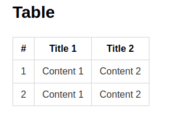
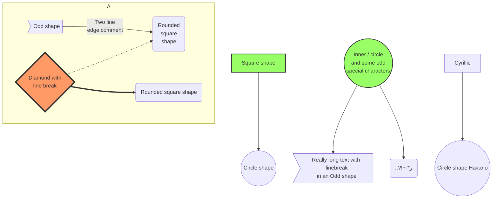
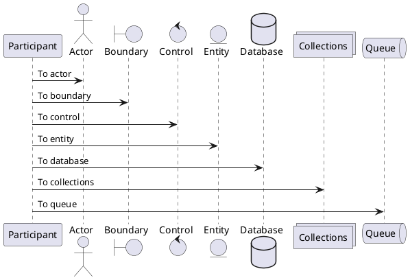

#TOC
- [1. Formating](#1-formating)
- [2. Table](#2-table)
- [3. Code style](#3-code-style)
- [4. Hình ảnh](#4-hình-ảnh)
- [5. Vẽ biểu đồ](#5-vẽ-biểu-đồ)
  - [5.1. Mermaid](#51-mermaid)
  - [5.2. PlantUML](#52-plantuml)
- [6. Công thức toán](#6-công-thức-toán)


## 1. Formating

**đây là bôi đậm**
*In nghiêng*
~~Gạch ngang~~
> Đây là một `quotation`

## 2. Table
| #   | Title 1   | Title 2   |
| --- | --------- | --------- |
| 1   | Content 1 | Content 2 |
| 2   | Content 1 | Content 2 |

## 3. Code style

```go
func main() {
    fmt.Println(123)
}
```

```js
console.log(123)
```

## 4. Hình ảnh


## 5. Vẽ biểu đồ

### 5.1. Mermaid



### 5.2. PlantUML


## 6. Công thức toán
$y = x^2$


Ex1: \w+.(jpg|png|jpeg)$
Ex2: ^[0-9.,]+$
Ex3: ^[\w.]+@[\w-]+(\.\w+)+$
Ex4: interface (?<interface>.+)\sstatus (?<status>\w+)\sip address (?<ip00>[0-9. ]+)\s(ip address secondary (?<ip01>[0-9. ]+))?


Step 1: ^((?!voucher).)*$
Step 2:   INFO.+User
Step 3:  claimed voucher